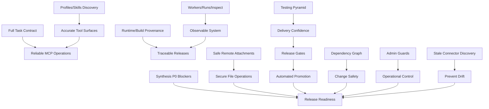

# Hermes ChatGPT MCP V4 Implementation Plan

**Status:** CANONICAL V4 DESIGN / CURRENT EVIDENCE
**Last reconciled:** 2026-08-19 (canonical design) + **2026-08-21 release-candidate truth-sync** (see [CHECKPOINT-2026-08-21.md](CHECKPOINT-2026-08-21.md))
**Documentation base:** 9900c10 (local ref only; deployed SHA NOT_PROVEN)
**See also:** [README.md](README.md) | [CURRENT_STATE.md](CURRENT_STATE.md) | [EVIDENCE_AND_OPEN_QUESTIONS.md](EVIDENCE_AND_OPEN_QUESTIONS.md)
**Derived from:** t_8a7b081c (`V4-IMPLEMENTATION-PLAN-DRAFT.md`)

---

## Phase-S Release-Candidate Gates (2026-08-21 truth-sync — supplemental)

This section overlays the immediate Phase-S gate sequence on top of the V4 implementation plan. It does **not** redefine the V4 P0 feature scope below. See [CHECKPOINT-2026-08-21.md](CHECKPOINT-2026-08-21.md) for the authoritative critical path and governance.

**Current blocker:** G1 (outcome-aware dependency authorization) — `t_b0901b4a` gave-up (partial) → `t_c4c38028` (freeze candidate) → `t_09f51d5a` (adversarial/race) → `t_8c125abe` (reactivate review) → `t_fc541b39` (independent ACCEPT) → `t_7c2f0fdd` (real-board dogfood). Gate closeout is **NOT_PROVEN** until `t_fc541b39` ACCEPT + `t_7c2f0fdd` proof.

**Phase-S gate sequence (gated, evidence-backed):**
1. Outcome-gate candidate closeout (`t_c4c38028`) + independent ACCEPT (`t_fc541b39`).
2. Real-board gate proof (`t_7c2f0fdd`).
3. Hold rebind to fresh GO + accepted gate (`t_e187bee7`; current authority — `t_e1b6bae8` is HISTORICAL/SUPERSEDED).
4. Clean build with pinned/rollback-ready identity (deployed connector SHA still **STILL_NOT_PROVEN**; must be pinned here).
5. Canary + fresh-session/provenance handshake (`t_be036abf`): fresh MCP/OAuth session + observed receipt (canary/release ID, Connector SHA, Core SHA/version, schema/tool-surface version, scopes actually granted/effective); mismatch/unknown identity ⇒ FAIL before mutation.
6. Canary E2E PASS (`t_be036abf`).
7. Exact-release human gate (revision-bound authorization — separate from any provenance `GO`).
8. Traffic switch → post-switch smoke → release acceptance → V4 cut.

> `t_dadd5ebf` fresh provenance **GO** is evidence only; it does **NOT** authorize build/deploy/release. The exact-release human gate is a separate, revision-bound authorization.

## Core V4 Control-Plane Capabilities (P0 Feature Scope)## Core V4 Control-Plane Capabilities (P0 Feature Scope)
These are the essential features required for the V4 release, beyond just the synthesis P0 blockers.

### 1. Profiles/Skills Discovery & Validation
- [ ] Implement profile/skill discovery and validation via existing primitives
- [ ] Document that `profile.yaml capabilities/refuses` are advisory only
- [ ] Use runtime effective CLI toolsets (not legacy `toolsets:`) for profile routing
- [ ] Represent spawnability as `dispatcher_eligible` vs `end_to_end_observed`
- [ ] Do NOT require new Hermes CLI commands such as `profile list --detailed` or `kanban inspect` where existing Python/API/source primitives suffice

### 2. Complete MCP Task Create/Edit Contract
- [ ] Inventory all 47 Kanban CLI entries, but V4 exposes ONLY approved MCP contracts by priority/risk. Never state 'implement all 47'.
- [ ] Ensure MCP `attach` supports both `local_path` and `content_base64` (Hermes agent already has `kanban_attach(content_base64)`; only MCP remote transport is missing)
- [ ] Implement attachment size validation (25MB unified cap policy)
- [ ] Expose approved MCP contracts per catalog (not blanket exposure)
- [ ] Implement idempotency keys for create/link/comment operations
- [ ] Add boundedness checks (task depth, comment size, attachment limits)
- [ ] Any genuinely necessary Hermes-core change must be isolated and labeled `UPSTREAM_DEPENDENCY`; do not silently mix it into MCP implementation

### 3. Workers/Runs/Get/Inspect with Guarded Terminate Contract
- [ ] Verify worker spawn environment (HERMES_PROFILE, HERMES_KANBAN_*)
- [ ] MCP consumes/maps current `hermes kanban runs <task_id> --json` primitive (already exists)
- [ ] V4 MCP `inspect_run` uses existing dashboard/source primitive (psutil via `/api/plugins/kanban/runs/{run_id}/inspect`); do NOT add `hermes kanban inspect` CLI
- [ ] Ensure heartbeat/stale/reclaim logic works correctly
- [ ] Verify dispatcher tick sequence and auto-decompose per tick
- [ ] Guarded terminate contract: verify `POST /api/plugins/kanban/runs/{run_id}/terminate` calls `reclaim_task()`

### 4. Runtime/Build Provenance
- [ ] Proven: `hermes version` exists and shows v0.20.2, upstream SHA, install source/method
- [ ] V4 MCP `get_runtime_info` exposes/pins known build metadata from existing primitives
- [ ] `hermes version --verbose` and connector-SHA-in-diagnostics are NOT proven; any Hermes CLI extension = UPSTREAM_DEPENDENCY
- [ ] Generate SBOM for each release (if implemented upstream)
- [ ] Verify connector SHA matches pinned version before promotion
- [ ] Add build metadata to Docker images (if applicable)

### 5. Safe Remote Attachments
- [ ] Implement `content_base64` field in MCP AttachInput schema (Hermes agent already supports it)
- [ ] Unify attachment size cap to 25MB across agent and connector (policy/limit contract; do not invent unproven connector constant names)
- [ ] Add input validation for base64 size and content type
- [ ] Virus scanning/quotas are optional future security ideas (P2/optional), not P0

### 6. Authorization/Contract/E2E/Release Gates (P0/P1 Delivery Requirements)
- [ ] Testing/contract/E2E gates, backwards compatibility, and release gating are P0/P1 delivery requirements, NEVER P3
- [ ] Implement contract tests validating MCP spec adherence
- [ ] Implement E2E tests for critical user flows
- [ ] Implement release gates with automated promotion criteria
- [ ] Implement backwards compatibility validation

### 7. Regression Coverage for Artifact-Completion Semantics
- [ ] Add regression case from THIS docs program: `kanban_complete` freezes durable result/artifacts; later workspace edits must NOT silently mutate completed artifacts. Corrections require explicit reissue/versioning.
- [ ] Treat this as an observed lifecycle behavior to codify/test, not automatically a backend bug unless intended contract says otherwise.

## Synthesis P0 Blockers (Release Requirements)
These must be resolved for V4 release but are not the full scope.

### [ ] P0-1: Add `content_base64` to MCP connector AttachInput
- Modify MCP connector schema to accept `content_base64` field (agent already sends it)
- Keep `local_path` for backward compatibility
- Test with various file types and sizes

### [ ] P0-2: Unify attachment size cap (25MB agent vs 10MB MCP)
- Apply unified 25MB policy/limit contract across surfaces (agent and connector)
- Verify both enforce same limit
- Add configuration option for custom limits
- Test boundary conditions (25MB, 25MB+1 byte)

### [ ] P0-3: Pin deployed connector SHA
- Implement version check via existing primitives (not inventing `--version` flag)
- Document exact SHA for production deployment
- Create verification step in release process

### [ ] P0-4: V4 skill queries: use `skills list` or `skill_view`, never `inspect`
- Update documentation to reflect `inspect` limitation
- Add warning/error when using `inspect` for builtin/local skills
- Ensure `skills list` shows all skills with origin
- Verify `skill_view` works for builtin/local/hub skills

### [ ] P0-5: Preserve sdlc-review force-load pattern
- Verify `kanban_db.py:10384` force-load still works
- Test that reviewer profile gets sdlc-review despite not having it locally
- Ensure historical crash does not reoccur
- Document this as a production-critical pattern

## Testing Pyramid (P0/P1 Delivery Requirements)
Cannot be relegated to P3; essential for delivery confidence.

### Unit Tests (70%)
- [ ] Test MCP schema validation (attach, create, edit, etc.)
- [ ] Test skill query helpers (list, view, origin detection)
- [ ] Test profile routing logic (effective toolsets calculation)
- [ ] Test attachment size validation and base64 decoding
- [ ] Test worker spawn environment variable setup
- [ ] Test heartbeat/stale/reclaim logic
- [ ] Test idempotency key generation and validation

### Integration Tests (20%)
- [ ] End-to-end: create task → assign worker → complete → verify
- [ ] Attachment flow: upload base64 file → verify storage → retrieve
- [ ] Comment flow: create comment → verify notification → edit/delete
- [ ] Worker spawn: dispatch task → verify env → verify execution
- [ ] Event flow: task update → verify webhook/notification
- [ ] Error cases: invalid input, size exceeded, auth failures

### Contract Tests (10%)
- [ ] Validate MCP spec adherence for all exposed methods
- [ ] Test schema versioning and backward compatibility
- [ ] Verify API response shapes match documentation
- [ ] Test error codes and messages for consistency
- [ ] Validate pagination and filtering where applicable

## Release Gates (P0/P1 Delivery Requirements)
Automated promotion criteria, not just P3.

### P0 Gate
- [ ] All five release blockers resolved
- [ ] Entire P0 feature scope implemented
- [ ] Runtime/build metadata and connector provenance verified/pinned
- [ ] Authorization, contract, and E2E gates pass
- [ ] Unit tests ≥ 70% coverage
- [ ] Integration tests pass for critical paths
- [ ] Contract tests pass for MCP methods
- [ ] Dogfood smoke test passes (basic create/complete cycle using disposable `hermes-chatgpt-e2e-*` fixture board)

### P1 Gate
- [ ] All P1 recommendations from synthesis implemented
- [ ] Unit tests ≥ 80% coverage
- [ ] Integration tests pass for all user flows
- [ ] Contract tests pass with versioning
- [ ] Performance benchmarks met (dispatch latency < 100ms)
- [ ] Security scan passes (no critical vulns)

### P2 Gate
- [ ] Optional supply-chain enhancements (SBOM where implemented upstream)
- [ ] Auth/scope plan reviewed and implemented
- [ ] Observability endpoints exposed and tested
- [ ] Stable/beta naming cleanup completed
- [ ] Docs versioned and published
- [ ] Load testing passes (100 concurrent tasks)

### GA Gate
- [ ] All previous gates passed
- [ ] No critical bugs in dogfood/QA (severe+ only)
- [ ] Performance benchmarks met under load
- [ ] Documentation complete and accurate
- [ ] Rollback plan tested and verified

## Dependency Graph

## Milestones
1. **M1 – Core Foundation**: Profiles/skills discovery, complete task contract, workers/runs/inspect implemented
2. **M2 – Safety & Observability**: Safe remote attachments, runtime/build provenance, basic observability
3. **M3 – P0 Blockers Complete**: All synthesis P0 blockers resolved
4. **M4 – Testing & Gates**: Testing pyramid implemented, release gates automated
5. **M5 – GA Ready**: All gates passed, dogfood/QA complete, rollback tested

## Acceptance Criteria
- All core V4 control-plane capabilities implemented and tested
- All synthesis P0 blockers resolved with tests
- Testing pyramid in place with ≥70% unit test coverage
- Release gates automated and passing
- Dogfood/QA plan executed successfully using this Kanban connector (disposable `hermes-chatgpt-e2e-*` fixture boards only)
- No regression in existing LOCAL-001..008 classifications
- Documentation updated to reflect current runtime (not outdated baseline)
- Artifact-completion regression test present and passing