# Hermes ChatGPT MCP V4 Roadmap

**Status:** CANONICAL V4 DESIGN / CURRENT EVIDENCE
**Last reconciled:** 2026-08-19 (canonical design) + **2026-08-21 release-candidate truth-sync** (see [CHECKPOINT-2026-08-21.md](CHECKPOINT-2026-08-21.md))
**Documentation base:** 9900c10 (local ref only; deployed SHA NOT_PROVEN)
**See also:** [README.md](README.md) | [CURRENT_STATE.md](CURRENT_STATE.md) | [EVIDENCE_AND_OPEN_QUESTIONS.md](EVIDENCE_AND_OPEN_QUESTIONS.md)
**Derived from:** t_8a7b081c (`V4-ROADMAP-DRAFT.md`)

---

## Vision## Vision
Enable reliable, secure, and observable AI agent orchestration via the Hermes ChatGPT MCP connector, with strong contracts, versioned schemas, and production-grade tooling.

## Prerequisites (from V4-LOCAL-SYNTHESIS)
- Hermes v0.20.2 baseline
- Kanban connector deployed (label `Kanban_Beta` is stale; actual backend stable)
- 14 profiles, 53 enabled skills (39 builtin, 14 local)
- Native tool registry: 87 leaf tools
- MCP connector exposes `attach(local_path)` only (SERVER_LOCAL_BOUND)
- No remote upload (base64/URL) in current MCP
- Size cap mismatch: agent 25MB vs MCP default 10MB
- `hermes skills inspect` cannot resolve builtin/local skills (hub-only)
- sdlc-review force-loaded into review workers
- No board-local pause/resume (global ESTOP only)
- Profile capabilities/refuses declarative only
- No live HTTP reachability proven for dashboard/native APIs
- Exact connector SHA STILL_NOT_PROVEN
- Authorization readback inconsistency (`get_board` capability readback inconsistent with successful writes)
- Command registration/`--help` != behavioral PASS
- Dogfood mutations MUST use disposable `hermes-chatgpt-e2e-*` fixture board(s), NEVER project board `hermes-chatgpt-mcp`. Read-only control-plane checks may read the project board.

## Phase-S vs V4 Horizons (2026-08-21 truth-sync — supplemental)

The canonical roadmap below is the long-range V4 plan. This section overlays the **immediate Phase-S release-candidate** horizon so the two are not confused. See [CHECKPOINT-2026-08-21.md](CHECKPOINT-2026-08-21.md) for the full critical path and governance rules.

**Decision (2026-08-21, `t_72108336` comment 579):** Do **NOT** convert all G1–G20 into Phase-S/beta blockers.
- **G1** (outcome-aware dependency authorization) is the *only* substantive new platform correction blocking immediate Phase-S.
- A minimal fresh-session / provenance test-integrity requirement is required for immediate E2E (the canary handshake).
- G2–G20 belong to existing V4 waves, the dogfood program, or other boards; tracked, not blocking, unless a concrete release-safety regression is proven.

**Immediate-E2E coverage vs later architecture:** G2 / G6 / G14 / G15 / G16 are minimally covered at immediate E2E via the fresh-session/provenance handshake; their full identity/session architecture remains later Wave0+ / other layers.

**Cross-board ownership:** G18 / G19 → `chatgpt-hermes-orchestration`; Telegram transport / full human-gate UX → `hermes-control-plane`; model/routing intelligence → Profile Factory. None delay immediate Phase-S unless a proven regression.

### Gap → Owner table (compact)

| Gap | Disposition for immediate Phase-S | Owner / lane |
|-----|-----------------------------------|--------------|
| G1 | **Immediate blocker** — outcome-aware dependency authorization | recovery chain `t_c4c38028`→`t_fc541b39`→`t_7c2f0fdd` |
| G2 / G6 / G14 / G15 / G16 | Immediate test integrity (handshake) + later full architecture | Wave0+ / other layers |
| G3 / G4 / G5 | Hermes Core / control-plane regressions | Hermes Core / control-plane |
| G7 | Auth principal separation | control-plane |
| G8 | Wave1 | `t_5ae3cfd5` |
| G9 / G10 | Profile Factory / model intelligence | Profile Factory |
| G11 | Wave3 | `t_94a82805` |
| G12 | Wave2 | `t_bc1e909d` |
| G13 | Cross-layer reconciliation | cross-layer |
| G17 | Phase-S exact-release minimum + control-plane full | control-plane |
| G18 / G19 | Orchestration | `chatgpt-hermes-orchestration` |
| G20 | Governance regression | governance |

> A provenance `GO` (e.g. `t_dadd5ebf`) is evidence, **not** release authorization. The exact-release human gate is a separate, revision-bound authorization.

## P0 Blockers (Release Blockers — NOT the whole P0 feature scope)
The following five synthesis items are RELEASE BLOCKERS for V4:
1. **Add `content_base64` to MCP connector AttachInput** – enable remote file upload
2. **Unify attachment size cap** – align agent (25MB) and MCP connector (currently 10MB)
3. **Pin deployed connector SHA** – verify exact version running in production
4. **V4 skill queries: use `skills list` or `skill_view`, never `inspect`** – hub-only limitation
5. **Preserve sdlc-review force-load pattern** – dispatcher must continue to append at dispatch time

## P0 Feature Scope (MUST include these in addition to release blockers above)
- Profile/skill discovery + validation
- Complete MCP task create/edit contract
- Workers/runs/get/inspect with guarded terminate contract
- Runtime/build/provenance
- Safe remote attachments
- Authorization/contract/E2E/release gates
- Regression coverage for artifact-completion semantics

**Contract boundary:** Inventory all 47 Kanban CLI entries, but V4 exposes ONLY approved MCP contracts by priority/risk; never require implementing all 47. Existing Python/API/source primitives are preferred. Any genuinely necessary Hermes-core change is isolated and labeled `UPSTREAM_DEPENDENCY`.

## P1 Recommendations (Important, Non-Blocking)
1. Use runtime effective CLI toolsets (not legacy `toolsets:`) for profile routing
2. Represent spawnability as `dispatcher_eligible` vs `end_to_end_observed`
3. Document global pause (ESTOP) vs board-local pause (absent)
4. Distinguish Kanban dashboard API paths from native `/v1/runs` paths
5. Treat `profile.yaml capabilities/refuses` as advisory, not enforced
6. Report MCP diagnostics/dispatch failures as backend observability

## Roadmap by Priority

### P0 (Release Blockers & Feature Scope & Delivery Requirements)
- [ ] MCP AttachInput schema extension (`content_base64`)
- [ ] Attachment size cap unification (25MB)
- [ ] Connector SHA pinning and versioning
- [ ] Skill query interface update (docs + tooling)
- [ ] sdlc-review force-load preservation (verified in dispatch)
- [ ] Profiles/skills discovery & validation
- [ ] Complete MCP task create/edit contract
- [ ] Workers/runs/get/inspect with guarded terminate contract
- [ ] Runtime/build/provenance (known runtime metadata and connector provenance/pinning)
- [ ] Safe remote attachments
- [ ] Authorization/contract/E2E/release gates (testing/contract/E2E gates, backwards compatibility, and release gating are P0/P1 delivery requirements, NEVER P3)
- [ ] Regression coverage for artifact-completion semantics

### P1 (Post-P0, Pre-Stable)
- [ ] Profile routing update (effective toolsets)
- [ ] Spawnability metrics enhancement
- [ ] Pause/resume documentation clarification
- [ ] API path separation (Kanban vs native)
- [ ] Profile capabilities/refuses advisory note
- [ ] MCP failure observability integration

### P2 (Stability & Observability)
- [ ] Optional supply-chain enhancements (such as SBOM where implemented upstream)
- [ ] Auth/scope plan for MCP connector
- [ ] Observability (metrics, tracing, health checks)
- [ ] Stable/beta naming cleanup (remove `Kanban_Beta` misnomer)
- [ ] Docs versioning strategy

### P3 (Extensions & Refinements)
- [ ] Reserved for future extensions (testing pyramid, migration strategy, release gates, dependency graph, admin guards moved to P0/P1)

### DO_NOT_EXPOSE (Unsafe/High-Privilege Surfaces — risk-based, not unknowns)
- [ ] Repair/gc destructive operations without guard
- [ ] Arbitrary kill/terminate without guard
- [ ] Arbitrary config/secrets/update/uninstall/auth mutation
- [ ] Board deletion or workdir mutation without explicit guard
- [ ] Generic command execution
- [ ] Other destructive operations that could compromise data integrity or security

### OPEN QUESTIONS (STILL_NOT_PROVEN — NOT DO_NOT_EXPOSE merely because unknown)
- [ ] Temporary arbitrary task skills (partial resolution; depends on profile contents)
- [ ] Fine-grained profile permissions enforcement (no enforcement path found in Hermes core)
- [ ] Exact historical C-IMPL-5 crash cause (historical; not safety-relevant for current contract)
- [ ] Deployed connector SHA (integration concern)
- [ ] Live API auth/enablement (integration concern)
- [ ] Plugin skill metadata source integration

## Milestones
1. **M1 – P0 Complete**: MCP connector supports remote upload, unified size cap, pinned SHA, fixed skill queries, sdlc-review preserved, profiles/skills discovery&validation, complete MCP task contract, workers/runs/inspect with guarded terminate, runtime/build/provenance, safe remote attachments, authorization/contract/E2E/release gates, artifact-completion regression coverage.
2. **M2 – P1 Complete**: Profile routing, spawnability, pause docs, API separation, advisory capabilities, MCP observability.
3. **M3 – P2 Complete**: Optional supply-chain enhancements, auth/scope, observability, naming cleanup, docs versioning.
4. **M4 – P3 Complete**: [Reserved for future extensions]
5. **M5 – GA**: V4 ChatGPT MCP connector declared stable.

## Acceptance Criteria (Per Milestone)
- All P0 blockers resolved with tests
- No regression in existing LOCAL-001..008 classifications
- Documentation updated to reflect current runtime (not outdated baseline)
- Dogfood/QA plan executed using this Kanban connector as subject
- Release gate criteria met (see Release Gates section)

## Dependency Graph

```mermaid
graph TD
    A[MCP AttachInput content_base64] --> B[Remote File Upload]
    C[Size Cap Unification] --> B
    D[Connector SHA Pinning] --> E[Versioned Releases]
    F[Skill Query Fix] --> G[Reliable Skill Discovery]
    H[sdlc-review Force-load] --> I[Review Lane Stability]
    J[Profile Routing Update] --> K[Accurate Tool Surfaces]
    L[Spawnability Metrics] --> M[Better Placement]
    N[Pause Docs] --> O[Clear Emergency Stop]
    P[API Separation] --> Q[Unambiguous Termination]
    R[Capabilities Advisory] --> S[Profile Design Clarity]
    T[MCP Observability] --> U[Failure Detection]
    V[Build Provenance] --> W[Traceable Artifacts]
    X[Auth/Scope Plan] --> Y[Secure Connector]
    Z[Observability] --> AA[Production Readiness]
    AB[Testing Pyramid] --> AC[Confidence in Changes]
    AD[Migration Strategy] --> AE[Backwards Compatibility]
    AF[Release Gates] --> AG[Automated Promotion]
    AH[Dependency Graph] --> AI[Change Safety]
    AJ[Admin Guards] --> AK[Operational Control]
    AL[Stale Connector Discovery] --> AM[Prevent Drift]
```

## Migration/BACKWARDS-COMPATIBILITY Strategy
- **Agent Side**: Keep `attach(local_path)`; add `content_base64` as optional field.
- **MCP Connector**: Version schema; deploy backward-compatible version before making `content_base64` required.
- **Size Cap**: Deploy agent and connector with same cap (25MB) via coordinated rollout.
- **Skill Queries**: Deprecate `inspect` for builtin/local; guide users to `skills list`/`skill_view`.
- **sdlc-review**: No change; force-load remains.
- **Documentation**: Version docs alongside code; use `stable`/`beta` tags.

## Release Gates
1. **P0 Gate**: All five release blockers AND the entire P0 feature scope resolved; runtime/build and connector provenance verified/pinned; authorization, contract, and E2E gates pass; dogfood smoke passes.
2. **P1 Gate**: P1 items implemented; integration tests pass; observability endpoints exposed.
3. **P2 Gate**: Optional supply-chain enhancements (such as SBOM where implemented upstream), auth/scope plan reviewed, naming cleanup complete, and docs versioned.
4. **GA Gate**: All previous gates passed; no critical bugs in dogfood/QA; performance benchmarks met.

## Testing Pyramid
- **Unit**: 70% – test individual functions (MCP schema, skill query helpers, profile routing logic)
- **Integration**: 20% – test end-to-end flows (attach, create/edit/assign, worker spawn, event notification)
- **Contract**: 10% – validate MCP spec adherence, schema versioning, API stability

## Stable/Beta Naming Cleanup
- Retire `Kanban_Beta` label; use `hermes-chatgpt-mcp` as stable connector name.
- Document that `Kanban_Beta` in discovery metadata is stale; do not infer backend beta from namespace.

## Build/SHA Provenance
- Use existing primitives for runtime and connector provenance (e.g., proven `hermes version` output and the connector's deployed discovery/diagnostic metadata).
- V4 MCP `get_runtime_info` exposes/pins known build metadata.
- `hermes version --verbose` and connector-SHA-in-diagnostics are NOT proven; any Hermes CLI extension is an `UPSTREAM_DEPENDENCY`.
- Embedding Git SHA and build timestamp in Hermes agent binary is an `UPSTREAM_DEPENDENCY` if required.
- Publish SBOM for each release (if implemented upstream).
- Verify connector SHA matches pinned version before promotion.

## Auth/Scope Plan
- **CURRENT proven scopes**: exactly `hermes:read`, `hermes:create`, `hermes:manage`, `hermes:board:create`; connection flow may include `offline_access`.
- Never present `kanban:read/write/admin` or `board:read/write/admin` as current. A finer model may appear only as explicitly PROPOSED with migration mapping.
- Implement scoped tokens for ChatGPT MCP; validate at dispatcher/gateway.
- Audit token usage in logs.

## Observability
- Metrics: dispatch tick latency, worker spawn success/fail, attachment size, MCP request counts/errors.
- Tracing: propagate trace IDs through gateway → dispatcher → worker.
- Health checks: `/health` endpoint for gateway and dispatcher.
- Alerts: on spawn failure rate, heartbeat reclaim, attachment oversize.

## Docs Versioning
- Keep `docs/` versioned alongside code (e.g., `docs/v4/`).
- Use `latest` for unstable, `stable` for GA release.
- Include version in doc footer.